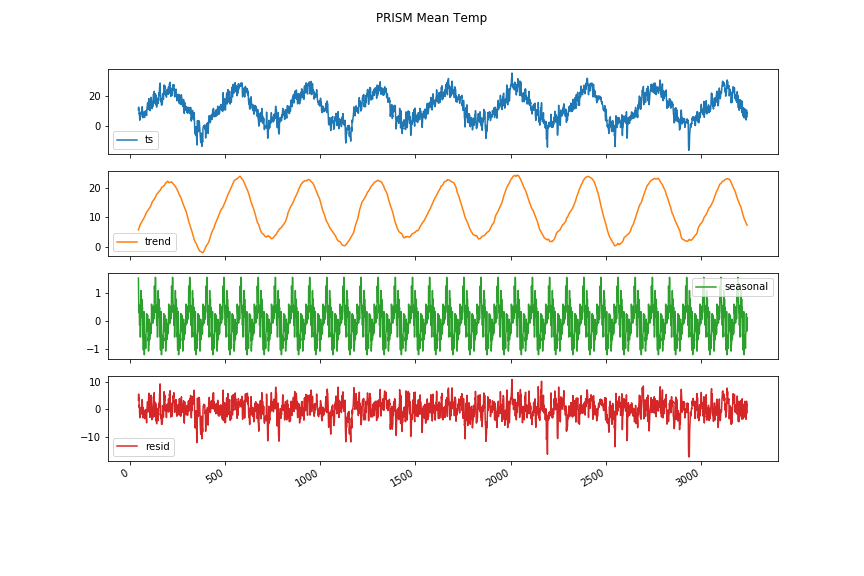
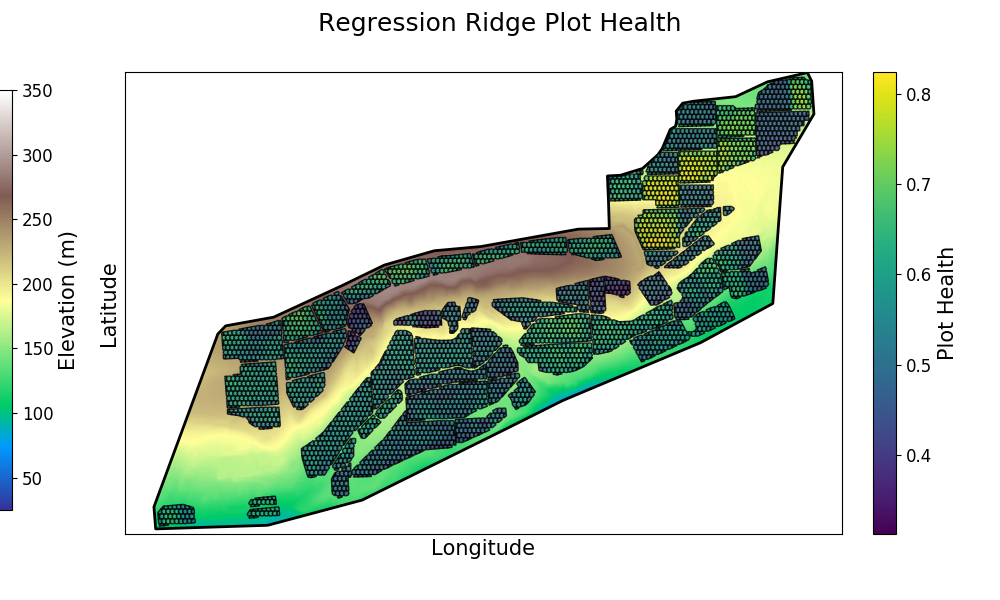
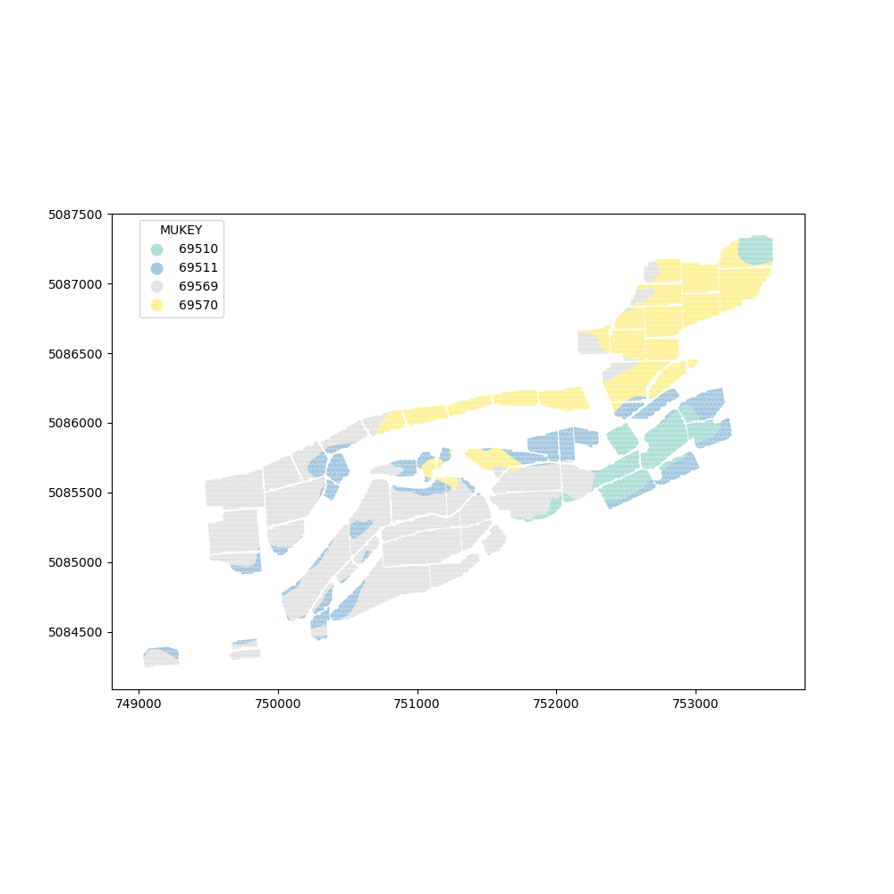
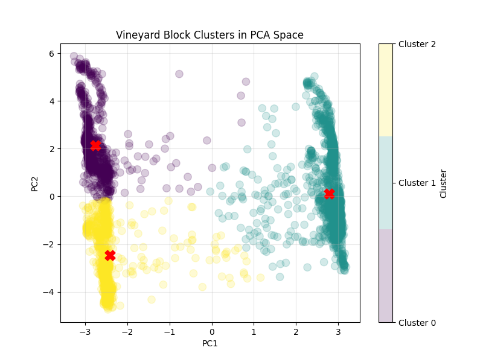
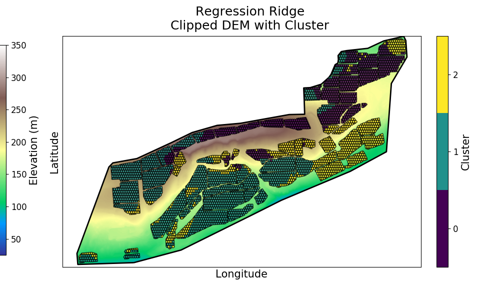
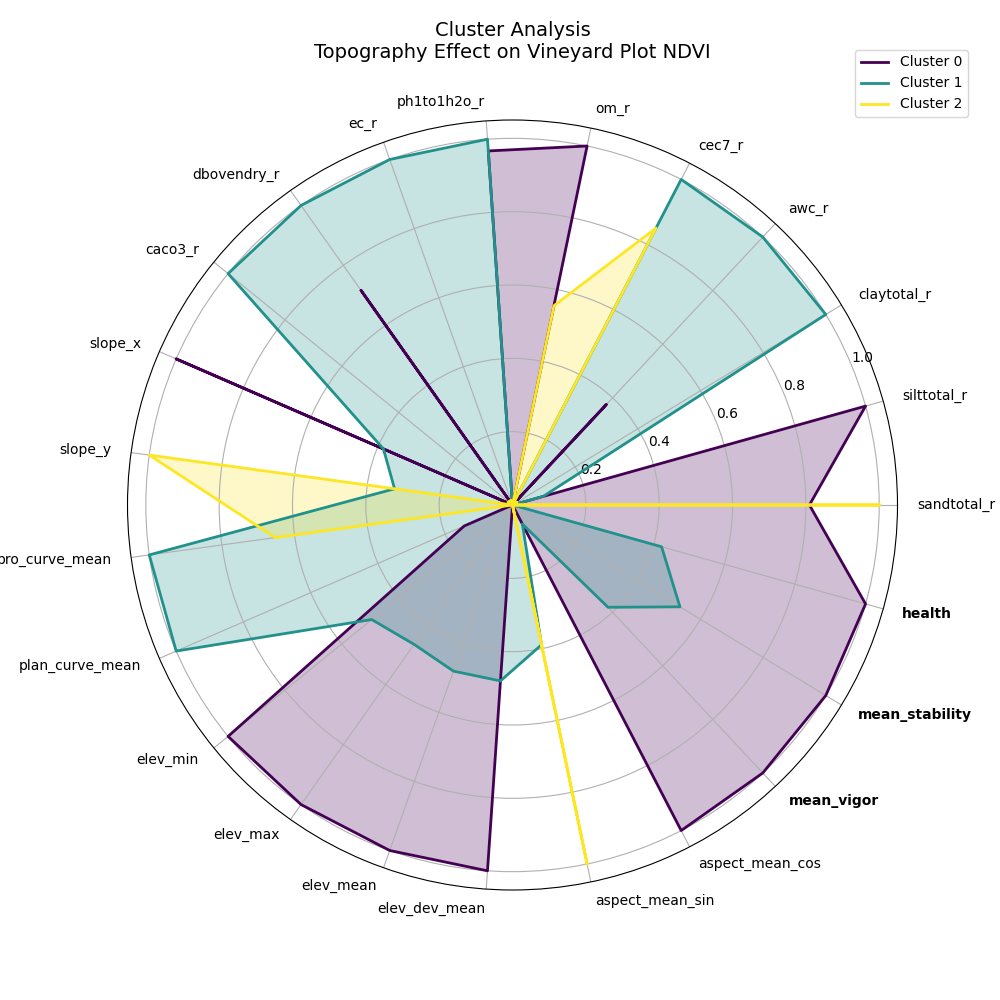
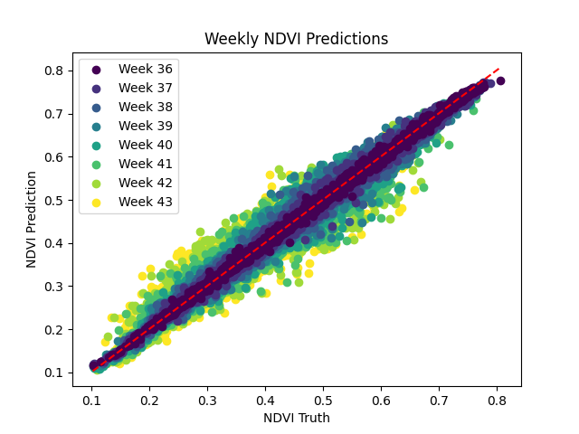
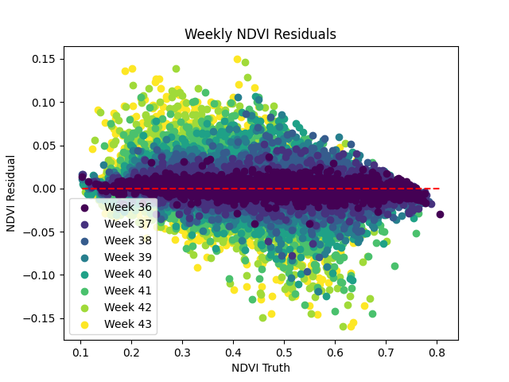
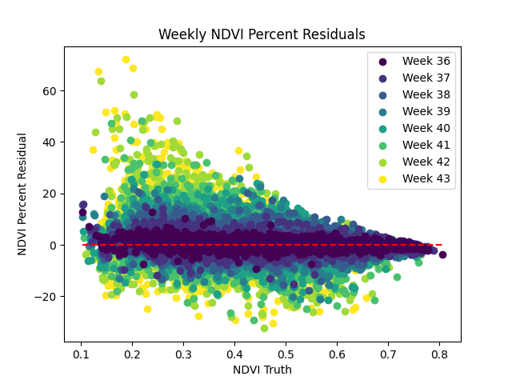
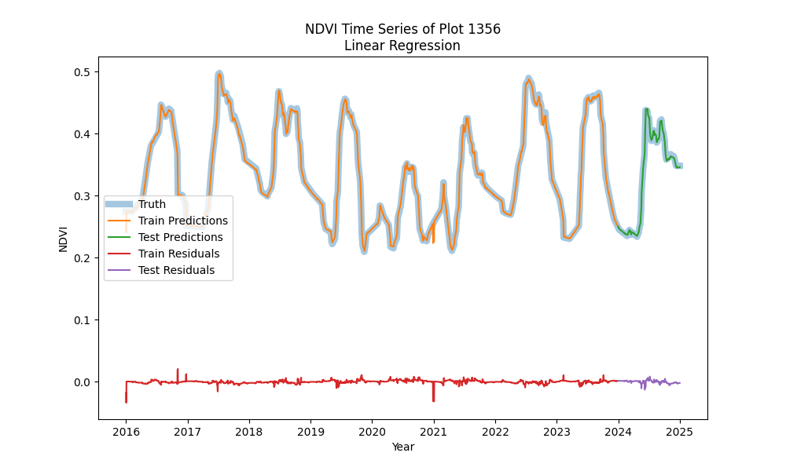

# GrapeExpectations

Predicting canopy development and vineyard stress using NDVI, weather, soil, and topography.

---

# Project Overview

The Normalized Difference Vegetation Index (NDVI) quantifies the difference between red and near-infrared reflectance from vegetation, typically measured via satellite imagery. NDVI is a widely validated indicator of vegetative vigor and is used to assess multiple aspects of vineyard health, including canopy growth, stress, and variability.

GrapeExpectations builds a comprehensive vineyard dataset and trains machine learning models to predict NDVI for vineyard plots, providing actionable insights into canopy development, stress detection, and potential yield impacts.

## Goal

- Build dataset of vineyard plot features from various sources -- National Map Downloader: DEM, USGS: Soil maps, Sentinel-2: NDVI
- Apply machine learning to link environmental drivers to NDVI trajectories
<!-- - Apply machine learning to extract insights into connections between Earth features as independant variables and Normalized Difference Vegetation Index (NDVI) as a dependant variable. -->
- Translate late season vegetation indices to grape chemistry
- Derive viticultural insights for growers and wine makers

## Current Progress

- **Data Integration:** Compiled 9 years of satellite NDVI, daily weather records, soil maps, and topographic data for all vineyard blocks.

- **Spatial Standardization:** Subdivided vineyard plots into consistent grid cells to align environmental, soil, and remote sensing data.

- **NDVI Processing:** Smoothed and interpolated NDVI time series to remove noise and create consistent seasonal curves.

- **Baseline Modeling:** Developed linear regression models to capture seasonal NDVI patterns and benchmark canopy development.

- **Ensemble ML Modeling:** Implemented Random Forest and XGBoost models using soil, weather, and topography features; preliminary results show strong correlation between environmental drivers and NDVI trajectories.

- **Clustering & Spatial Analysis:** Applied PCA and K-means clustering to identify distinct vineyard zones, highlighting spatial variability and potential management units.

- **Documentation & Reproducibility:** Established a clear pipeline for data preprocessing, modeling, and visualization in Python notebooks, ensuring repeatability and scalability for future analyses.


## Future Direction / Applications
- **Probabilistic & Bayesian Modeling**
    - Introduce Bayesian state-space models and MCMC sampling to treat NDVI as an evolving latent state.
    - Quantify uncertainty in canopy development predictions, enabling early detection of water stress or other anomalies.
- **Irrigation & Water Management**
    - Use model outputs to inform precision irrigation schedules.
    - Detect sub-block variability in water stress, guiding targeted interventions to optimize vine health and conserve water.
- **Vineyard Zoning & Management Units**
    - Expand clustering analysis to dynamically define vineyard management zones based on soil, topography, and NDVI trends.
    - Provide actionable maps for canopy uniformity, harvest planning, and targeted inputs.
- **Forecasting & Operational Decision Support**
    - Predict NDVI 1–3 weeks ahead to help anticipate canopy changes, stress events, or ripening trends.
    - Integrate environmental forecasts to support proactive vineyard management decisions.
- **Linking Vegetation to Grape Composition**
    - Investigate relationships between NDVI trajectories and grape chemistry (°Brix, TA, pH).
    - Enable predictive insights that inform harvest timing and fruit quality optimization.
- **Multi-Site Scalability**
    - Generalize modeling framework to other vineyard blocks or regions.
    - Enable cross-site comparisons and standardized decision-support tools for broader operational use.
---

# Data
### Files for a single vineyard in the Columbia Valley are included. More can be downloaded to duplicate workflow.
- **Polygons:** Area geometries of vineyard facility and individual plots.
  - **Source:** Google Earth & Rasterio  
  - Further subsampled using shapely and numpy
- **Digital Elevation Model:**  
  - **Source:** [National Map Downloader](https://apps.nationalmap.gov/downloader/#/)
  - Downloaded in notebook
- **Weather data:** Vineyard-wide temperature, rainfall, GDD, etc.  
  - **Source:** [PRISM Climate Data](https://prism.oregonstate.edu/downloads/)  
  - Downloaded manually, extracted and clipped in notebook
  
  
  
  
---
# Workflow

## Data Wrangling
Regression Ridge data has already been wrangled and is ready for ML. All notebooks for data wrangling are contained in data_wrangling folder. 
  
### [00_subsample_polygons](https://github.com/simonhansedasi/GrapeExpectations/blob/main/RegressionRidge/data_wrangling/00_subsample_polygons.ipynb)

Import and convert polygons to data objects. Divide polygons into minimum sized hexagons to increase variance of features and increase sample space.


### [01_clip_dem](https://github.com/simonhansedasi/GrapeExpectations/blob/main/RegressionRidge/data_wrangling/01_clip_dem.ipynb)

Use polygons to clip and extract elevation data from a DEM geotiff file. Capable of doing vineyard-wide or plot-wide elevation data gathering.

<p align="center">
  
</p>


### [02_breakdown_dem](https://github.com/simonhansedasi/GrapeExpectations/blob/main/RegressionRidge/data_wrangling/02_breakdown_dem.ipynb)

Use rasterstats to derive plot-wise topographic features from clipped elevation data. Features engineered include plot area, slope, aspect, and curvature. These features are further split into directional components for eventual machine learning.
<p align="center">
  
</p>

### [03_get_temp_data](https://github.com/simonhansedasi/GrapeExpectations/blob/main/RegressionRidge/data_wrangling/03_get_temp_data.ipynb)

Iterate over downloaded PRISM weather data and clip to vineyard polygon. Regression Ridge is large enough to capture a single PRISM polygon, so one measurement per weather feature per day. 

<p align="center">
  
</p>

### [04-2_ndvi_smol](https://github.com/simonhansedasi/GrapeExpectations/blob/main/RegressionRidge/data_wrangling/04-2_ndvi_smol.ipynb)

Capture various vegetative indices via Sentinel-2 satellite imagery. These measurements are then smoothed and aggregated to provide data for ML.
<p align="center">
  
</p>

### [05_soil](https://github.com/simonhansedasi/GrapeExpectations/blob/main/RegressionRidge/data_wrangling/05_soil.ipynb)

Clips polygons from USGS soil map. Analyzes horizon components and computes percent weight of soil features.
<p align="center">
  
</p>

### [06_assemble_data](https://github.com/simonhansedasi/GrapeExpectations/blob/main/RegressionRidge/data_wrangling/06_assemble_data.ipynb)

Assemble all the various features for ML.

---

## ML

Assembled data includes 3598 individual plot cells capturing NDVI over 9 years. Each cell features describe surface topography, weather, and soil context. Seasonal NDVI curves are supplied as features to predict coming weeks.

### [PCA & Clustering](https://github.com/simonhansedasi/GrapeExpectations/blob/main/RegressionRidge/ML/clustering.ipynb)
Perform Principal Component Analysis to reduce feature space to two dimensions. Embedded a gradient boosted regressor to fit health targets and dependant on surface and soil features. Using these embeddings, Kmeans clustering finds 3 descriptive clusters.
<p align="center">
  
</p>

These clusters can be mapped to the vineyard to compare with soil or topography distributions.

<p align="center">
  
</p>

Cluster feature weights can be examined for insights for dependence of NDVI inter-year vigor and stability on system variables.

<p align="center">
  
</p>


### [Forest Ensemble NDVI Prediction](https://github.com/simonhansedasi/GrapeExpectations/blob/main/RegressionRidge/ML/forest_ensemble.ipynb)
Ensemble of decision trees and regressors used to predict future week NDVI. Machine learning ensemble includes Random Forest, Extra Tree Regressor, Gradient Boosting Regressor, XGBRegressor, KNeighbors Regressor. ElasticNetCV is used as a meta model and final estimator. This multi-output regressor achieves R2: 0.992, RMSE: 0.000084 on the train set, and R2 0.967, RMSE 0.00033 on the tune set.
<p align="center">
  
</p>

Residuals show a slight pattern, indicating further tuning available. Further, residuals remain tight for the near weeks and spreads as the model predicts more distant weeks. Time series prediction may be a better approach.
<p align="center">
  
</p>

<p align="center">
  
</p>


### [Time Series Prediction](https://github.com/simonhansedasi/GrapeExpectations/blob/main/RegressionRidge/ML/time_series.ipynb)
Simple linear regression proves to be extremely effective with a handful of features. Ready to be scaled to robust single model predicting all plots.

<p align="center">
  
</p>


---

## Getting Started

This project was created using Jupyter Lab. Installation assumes conda and jupyter lab are already installed. The tech stack is quite sensitive to versions and conflicts, so it is very important to install the conda environment to reproduce results.

### Installation:

- Install conda environment via terminal by running the following command. These commands can be found in a .txt file in the repository root folder.

```console
conda create -n GrapeExpectations python=3.7.6 -y

conda activate GrapeExpectations

pip install --upgrade pip

pip install \
lxml==4.5.0 \
shapely==2.0.7 \
geopandas==0.10.2 \
requests==2.31.0 \
tqdm \
rasterio==1.2.10 \
matplotlib==3.1.3 \
pandas==1.0.1 \
numpy==1.21.6 \
rasterstats==0.20.0 \
earthengine-api==0.1.407 \
geemap==0.20.4 \
scipy==1.4.1 \
scikit-learn==1.0.2

sudo apt update
sudo apt install gdal-bin libgdal-dev

pip install GDAL==$(gdal-config --version)

pip install ipykernel
python -m ipykernel install --user --name=GrapeExpectations --display-name "Python 3.7.6 (GrapeExpectations)"

```


 