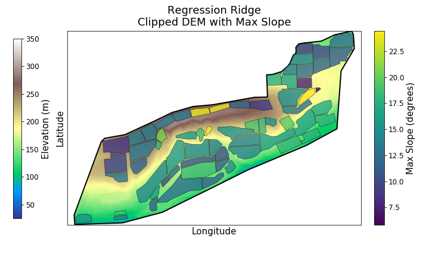

# 🍇 GrapeExpectations

Predicting **vineyard NDVI integrals** using weather and plot data.  
Data-driven insights for vineyard monitoring and optimization.

---

## Project Goal

- Use **machine learning** to predict seasonal NDVI integrals for vineyard plots  
- Understand which **weather variables and plot features** drive vegetation growth  
- Provide **early insights into vine vigor and productivity**

---

## Data
- **Polygons:** Area geometries of vineyard facility and individual plots
    - **Source:** Google Earth & Rasterio
- **Digital Elevation Model:** 
    - **Source:** https://apps.nationalmap.gov/downloader/#/
    

- **Weather data**:Vineyard wide temperature, rainfall, GDD, etc:
    - **Source:** https://prism.oregonstate.edu/downloads/
- **Plot characteristics**: elevation, slope, aspect, soil proxies
    - **Source:** Derived from Digintal Elevation Model
    

- **NDVI measurements**: derived from remote sensing for vegetation monitoring using Copernicus satellite data. 

---

## Features

- Plot-level terrain features: slope, aspect (sin/cos), elevation  
- Weather features: seasonal and daily aggregates, growing degree days  
<!-- - NDVI metrics for model training: integral, peak, greenup, senescence   -->

---

## Modeling

- **Target**: NDVI integral per plot  
- **Model**: XGBoost regression  
 - **R2:** 0.82
 
 
 
 
- **Techniques**:  
  - Train/test split with early stopping  
  - Feature importance analysis  
  - Residual evaluation to detect bias patterns  

---
