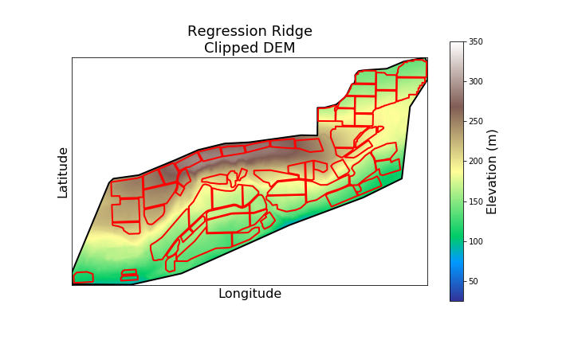

# 🍇 GrapeExpectations

Predicting **vineyard NDVI integrals** using weather and plot data.  
Data-driven insights for vineyard monitoring and optimization.

---

## Project Goal

- Use **machine learning** to predict seasonal NDVI integrals for vineyard plots  
- Understand which **weather variables and plot features** drive vegetation growth  
- Provide **early insights into vine vigor and productivity**

### NDVI and NDVI Integral
The Normalized Difference Vegetation Index (NDVI) is a measure of vegetation health derived from satellite or aerial imagery. It captures how much light plants absorb versus reflect, giving a proxy for vigor and canopy density.

The NDVI integral sums NDVI over the growing season, effectively measuring total vegetation activity. In viticulture, this is crucial because:

It reflects overall vine growth and leaf area development

It correlates with canopy size, photosynthetic activity, and potential yield

Early-season NDVI integrals can guide management decisions, like irrigation, pruning, and harvest timing

By predicting NDVI integrals from weather and plot features, we can provide early insights into vine health and vineyard productivity, enabling more informed and timely interventions.

---

## Data
- **Polygons:** Area geometries of vineyard facility and individual plots
    - **Source:** Google Earth & Rasterio
- **Digital Elevation Model:** 
    - **Source:** https://apps.nationalmap.gov/downloader/#/
    

- **Weather data**:Vineyard wide temperature, rainfall, GDD, etc:
    - **Source:** https://prism.oregonstate.edu/downloads/
- **Plot characteristics**: elevation, slope, aspect, frost risk
    - **Source:** Derived from Digintal Elevation Model
    

- **NDVI measurements**: derived from remote sensing for vegetation monitoring using Copernicus satellite data. 

---

## Features

- Plot-level terrain features: slope, aspect (sin/cos), elevation  
- Weather features: seasonal and daily aggregates, growing degree days  
<!-- - NDVI metrics for model training: integral, peak, greenup, senescence   -->

---

## Modeling

**Goal:** Predict NDVI integral per vineyard plot  

- **Model:** XGBoost regression  
- **Test R²:** 0.82 ✅ — strong predictive performance  

**Predictions vs Observations:**  

**Residuals:**  

**Feature Importance:**  
- Top drivers reflect **biological constraints** on vine growth:  
  - **VPD & minimum temperatures** → canopy development and stress tolerance  
  - **Slope & aspect** → microclimate and sunlight exposure  
  - **Frost days** → sensitivity during early growth  
  - **Elevation** → temperature gradients and site-specific conditions  

**Techniques:**  
- Train/test split with early stopping  
- Feature importance analysis  
- Residual evaluation to detect bias patterns  

---

